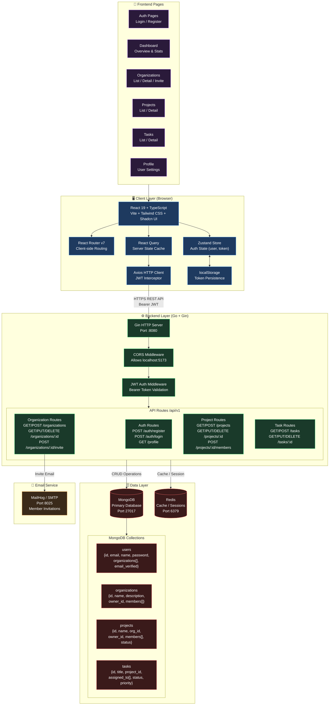

# System Architecture Diagram

> High-level view of the EduClaaS Task Management system — how all layers and services connect.

## Key Architectural Decisions

| Concern | Solution | Rationale |
|---|---|---|
| Client state | Zustand | Lightweight, minimal boilerplate for auth state |
| Server state | React Query | Automatic caching, background refetch, cache invalidation |
| Authentication | JWT (Bearer token) | Stateless, scalable, stored in localStorage |
| API communication | Axios + interceptors | Centralized token injection and 401 handling |
| Database | MongoDB | Flexible document model for nested members/tags |
| Cache | Redis | Fast session/cache layer alongside MongoDB |
| Backend framework | Go + Gin | High performance, low latency HTTP server |
| Frontend framework | React + Vite | Fast HMR, TypeScript-first, modern tooling |
