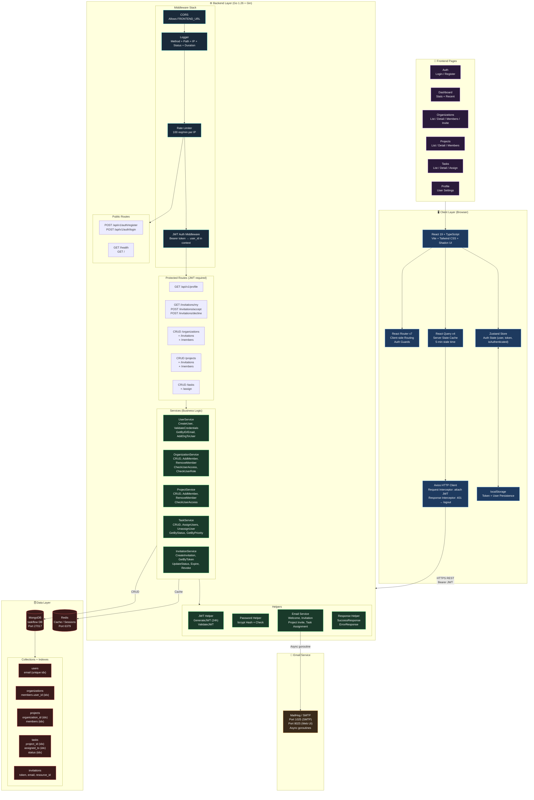

# System Architecture Diagram

> Complete architecture of the EduClaaS TaskFlow system — all layers, services, and data flows.



## Architecture Decisions

| Concern | Solution | Rationale |
|---|---|---|
| Client state | Zustand + persist | Lightweight auth state with localStorage persistence |
| Server state | React Query | Auto-caching, background refetch, cache invalidation |
| Auth | JWT (24h expiry) | Stateless, scalable; stored in localStorage |
| API layer | Axios + interceptors | Centralized token injection and 401 auto-logout |
| Database | MongoDB | Flexible document model for nested members/tags |
| Cache | Redis | Fast session/cache layer (initialized, ready to use) |
| Email | gomail + MailHog | Async goroutines; MailHog for local dev |
| Rate limiting | Per-IP in-memory | 100 req/min, auto-cleanup goroutine |
| Backend | Go + Gin | High-performance, low-latency HTTP |
| Frontend | React + Vite | Fast HMR, TypeScript-first |

## Layer Responsibilities

```
Handler  → Parse request, validate input, check auth/permissions, call service
Service  → Business logic, DB operations, orchestration
Model    → Data structures, BSON/JSON tags, request/response DTOs
Helper   → JWT, bcrypt, email, response formatting
Middleware → CORS, logging, rate limiting, JWT validation
```
