# Use Case Diagram

> All actors and their interactions with the EduClaaS TaskFlow system.

```mermaid
graph LR
    %% ── Actors ──────────────────────────────────────────────────────────────
    Guest(["👤 Guest\n(Unauthenticated)"])
    Member(["👥 Member\n(Org Member)"])
    Admin(["🛡️ Admin\n(Org Admin)"])
    Owner(["👑 Owner\n(Org Owner)"])
    ProjOwner(["📁 Project Owner"])

    %% ── System Boundary ─────────────────────────────────────────────────────
    subgraph System["EduClaaS TaskFlow System"]

        subgraph Auth["🔐 Authentication"]
            UC1["Register Account"]
            UC2["Login"]
            UC3["Logout"]
            UC4["View / Edit Profile"]
            UC5["Receive Welcome Email"]
        end

        subgraph OrgMgmt["🏢 Organization Management"]
            UC6["View My Organizations"]
            UC7["Create Organization"]
            UC8["View Organization Detail"]
            UC9["Edit Organization"]
            UC10["Delete Organization"]
            UC11["View Organization Members"]
        end

        subgraph OrgInvite["📨 Org Invitation Management"]
            UC12["Send Org Invitation (by email + role)"]
            UC13["List Org Invitations"]
            UC14["Revoke Org Invitation"]
            UC15["Accept Invitation"]
            UC16["Decline Invitation"]
            UC17["View My Pending Invitations"]
        end

        subgraph OrgMembers["👥 Org Member Management"]
            UC18["Update Member Role"]
            UC19["Remove Member from Org"]
        end

        subgraph ProjMgmt["📁 Project Management"]
            UC20["View Projects"]
            UC21["Create Project"]
            UC22["View Project Detail"]
            UC23["Edit Project"]
            UC24["Delete Project"]
            UC25["View Project Members"]
        end

        subgraph ProjInvite["📨 Project Invitation Management"]
            UC26["Send Project Invitation"]
            UC27["List Project Invitations"]
            UC28["Revoke Project Invitation"]
        end

        subgraph ProjMembers["👥 Project Member Management"]
            UC29["Remove Member from Project"]
        end

        subgraph TaskMgmt["✅ Task Management"]
            UC30["View Tasks"]
            UC31["Create Task"]
            UC32["View Task Detail"]
            UC33["Edit Task"]
            UC34["Delete Task"]
            UC35["Assign Users to Task"]
            UC36["Unassign User from Task"]
            UC37["Change Task Status"]
            UC38["Set Task Priority"]
            UC39["Set Due Date & Tags"]
            UC40["Receive Task Assignment Email"]
        end

        subgraph Dashboard["📊 Dashboard"]
            UC41["View Summary Stats"]
            UC42["View Recent Tasks"]
            UC43["View Recent Projects"]
        end

    end

    %% ── Guest ───────────────────────────────────────────────────────────────
    Guest --> UC1
    Guest --> UC2

    %% ── Member (authenticated) ───────────────────────────────────────────────
    Member --> UC3
    Member --> UC4
    Member --> UC5
    Member --> UC6
    Member --> UC7
    Member --> UC8
    Member --> UC11
    Member --> UC15
    Member --> UC16
    Member --> UC17
    Member --> UC20
    Member --> UC21
    Member --> UC22
    Member --> UC25
    Member --> UC30
    Member --> UC31
    Member --> UC32
    Member --> UC33
    Member --> UC37
    Member --> UC38
    Member --> UC39
    Member --> UC40
    Member --> UC41
    Member --> UC42
    Member --> UC43

    %% ── Admin extends Member ─────────────────────────────────────────────────
    Admin --> UC9
    Admin --> UC12
    Admin --> UC13
    Admin --> UC14
    Admin --> UC18
    Admin --> UC19
    Admin --> UC23

    %% ── Owner extends Admin ──────────────────────────────────────────────────
    Owner --> UC10

    %% ── Project Owner ────────────────────────────────────────────────────────
    ProjOwner --> UC24
    ProjOwner --> UC26
    ProjOwner --> UC27
    ProjOwner --> UC28
    ProjOwner --> UC29
    ProjOwner --> UC34
    ProjOwner --> UC35
    ProjOwner --> UC36

    %% ── Inheritance ──────────────────────────────────────────────────────────
    Member -.->|"inherits"| Guest
    Admin  -.->|"inherits"| Member
    Owner  -.->|"inherits"| Admin
    ProjOwner -.->|"is also"| Member

    classDef actor fill:#1e3a5f,stroke:#4a9eff,color:#fff
    classDef usecase fill:#1a2a1a,stroke:#4aff8a,color:#fff

    class Guest,Member,Admin,Owner,ProjOwner actor
```

## Actor Descriptions

| Actor | Description | Key Permissions |
|---|---|---|
| **Guest** | Unauthenticated visitor | Register, Login only |
| **Member** | Authenticated user, basic org member | View/create orgs & projects, task CRUD, dashboard, accept/decline invitations |
| **Admin** | Organization admin | All Member + edit org, send/revoke invitations, manage member roles, remove members |
| **Owner** | Organization owner/creator | All Admin + delete organization |
| **Project Owner** | Creator of a specific project | Delete project, send/revoke project invitations, manage project members, assign/unassign tasks |

## Use Case Count

| Domain | Count |
|---|---|
| Authentication | 5 |
| Organization Management | 6 |
| Org Invitation Management | 6 |
| Org Member Management | 2 |
| Project Management | 6 |
| Project Invitation Management | 3 |
| Project Member Management | 1 |
| Task Management | 11 |
| Dashboard | 3 |
| **Total** | **43** |
