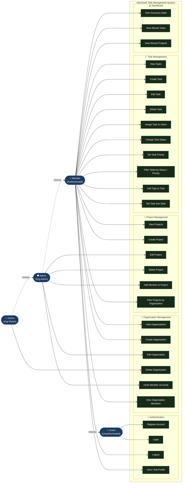

# Use Case Diagram

> All actors and their interactions with the EduClaaS Task Management system.

## Actor Descriptions

| Actor | Description | Permissions |
|---|---|---|
| **Guest** | Unauthenticated visitor | Register, Login only |
| **Member** | Authenticated user, basic org member | View/create orgs & projects, full task CRUD, dashboard |
| **Admin** | Organization admin role | All Member permissions + edit org, invite members, manage projects |
| **Owner** | Organization owner/creator | All Admin permissions + delete organization |

## Use Case Summary

| Domain | Total Use Cases | Key Actions |
|---|---|---|
| Authentication | 4 | Register, Login, Logout, Profile |
| Organizations | 6 | CRUD + Invite + View Members |
| Projects | 6 | CRUD + Add Members + Filter |
| Tasks | 10 | CRUD + Assign + Status + Priority + Tags + Due Date |
| Dashboard | 3 | Stats + Recent Tasks + Recent Projects |
