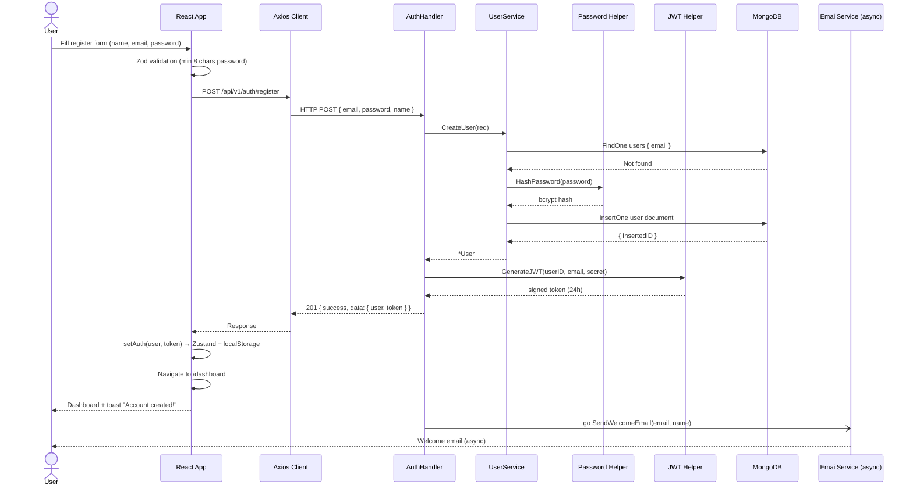
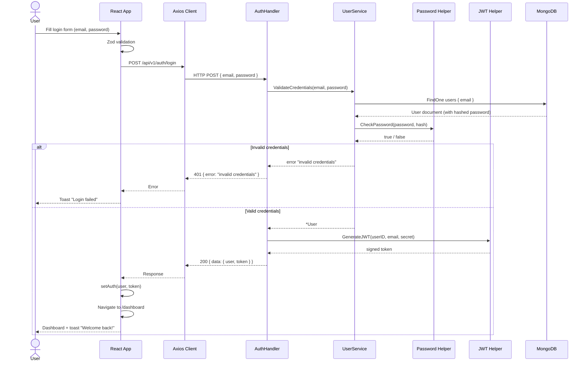
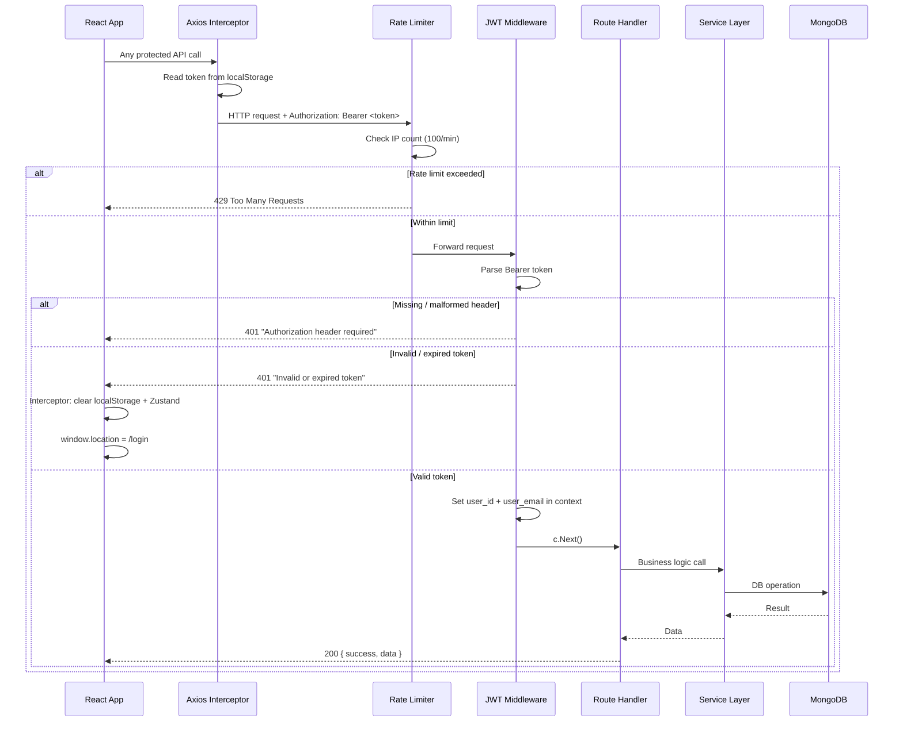
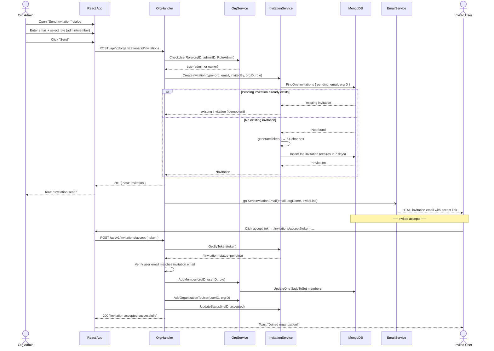
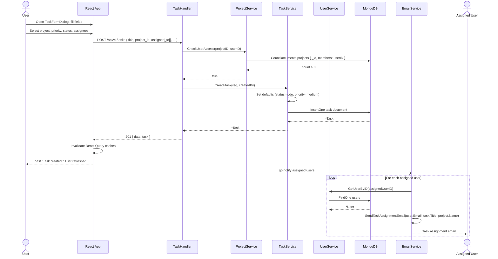
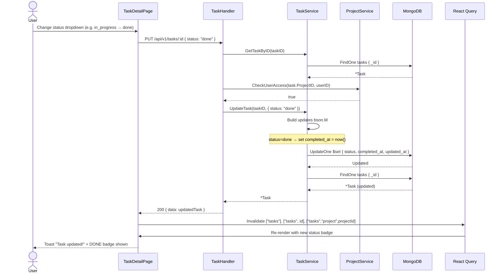

# Sequence Diagrams

> Step-by-step message flows for the most critical system interactions.

---

## 1. User Registration Flow

---

## 2. Login & JWT Auth Flow

---

## 3. Protected API Request with JWT Middleware

---

## 4. Organization Invitation Flow

---

## 5. Task Creation with Email Notification

---

## 6. Task Status Update Flow

