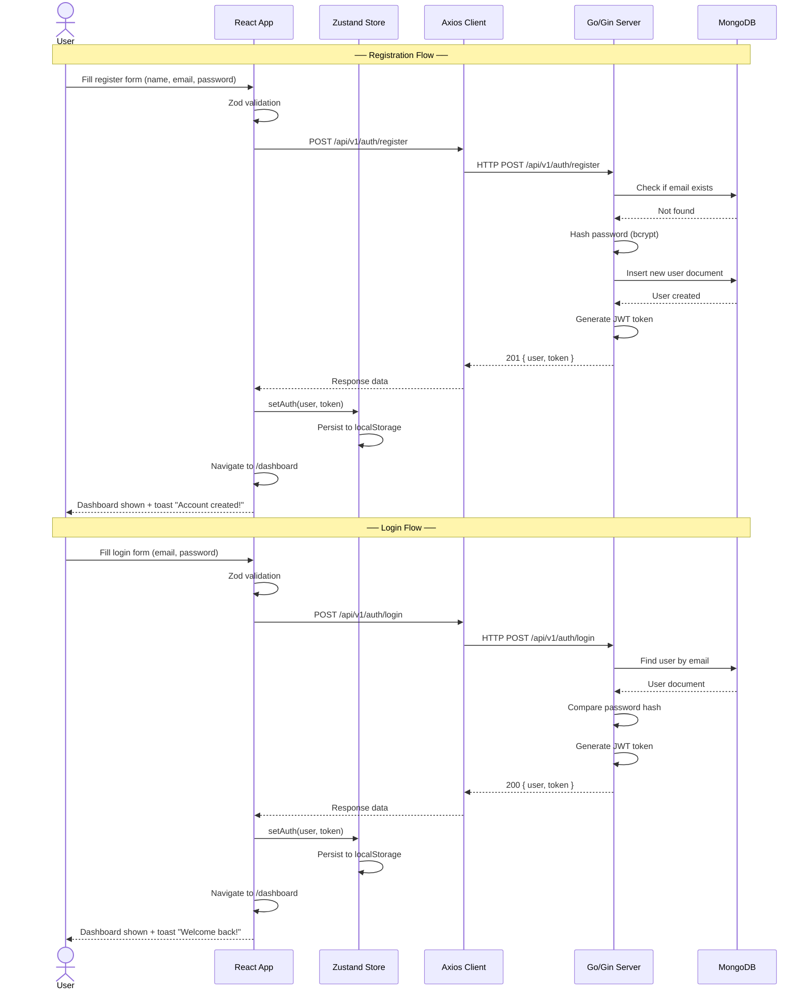
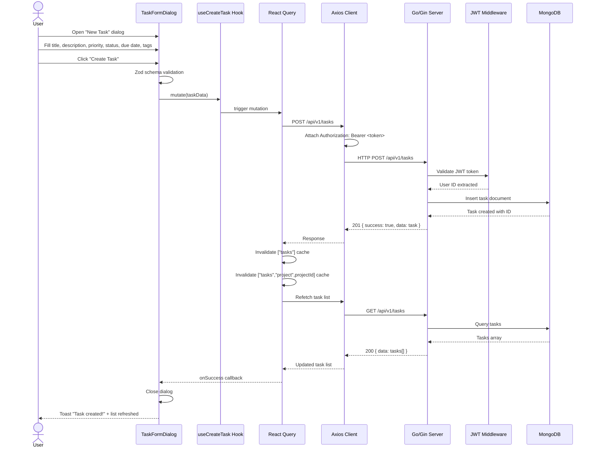
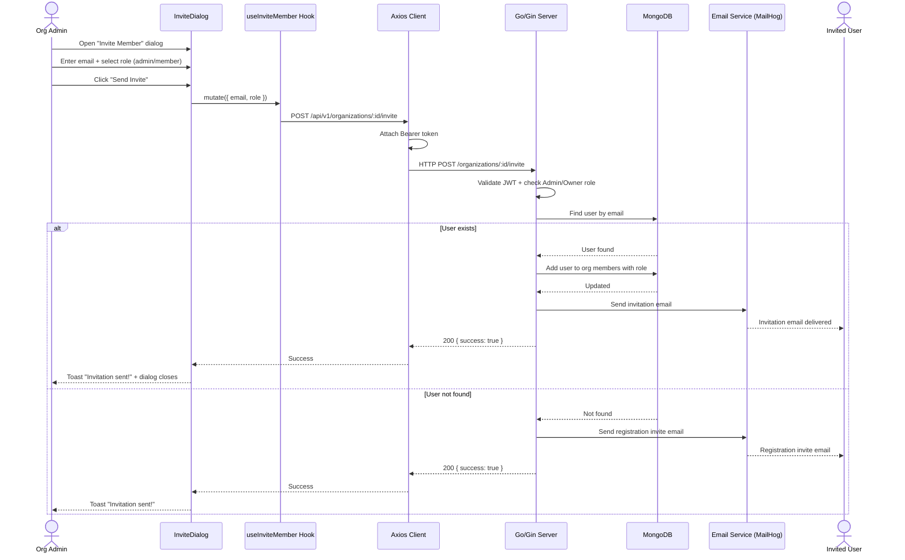
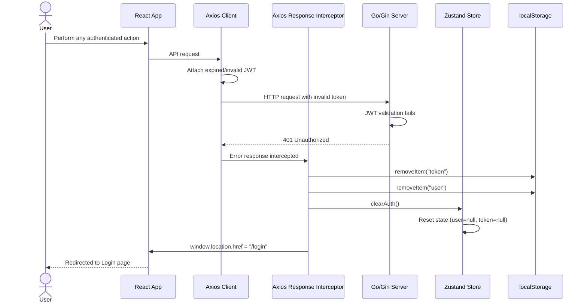
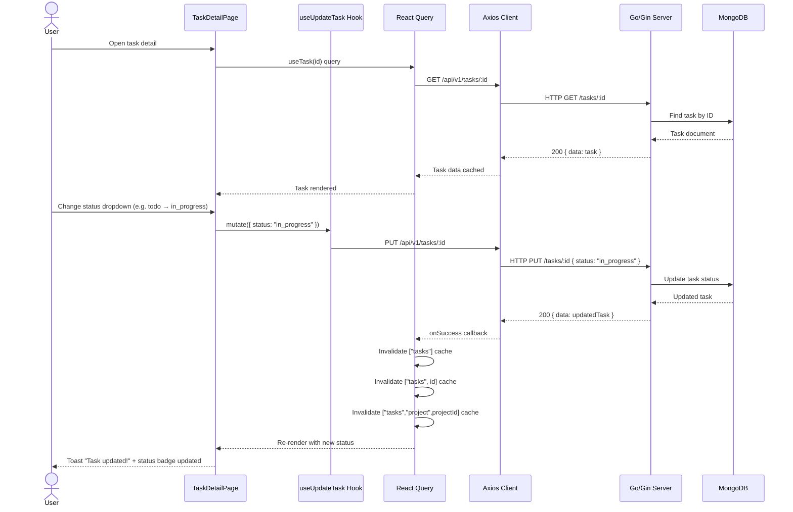

# Sequence Diagrams

> Step-by-step message flows for the most critical system interactions.

---

## 1. User Registration & Login Flow

---

## 2. Create Task Flow

---

## 3. Organization Invite Member Flow

---

## 4. JWT Token Expiry / 401 Auto-Logout Flow

---

## 5. Task Status Update Flow

