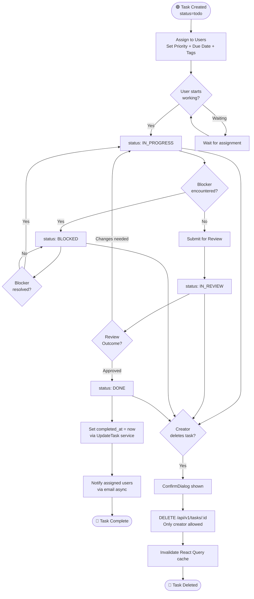

# Activity Diagrams

> Step-by-step process flows showing decision points and parallel activities.

---

## 1. User Authentication Activity

```mermaid
flowchart TD
    Start([🟢 User Opens App]) --> CheckToken{Token in\nlocalStorage?}

    CheckToken -->|Yes| ValidateToken{Zustand\nisAuthenticated?}
    CheckToken -->|No| ShowLogin[Show Login Page]

    ValidateToken -->|true| LoadDashboard[Load Dashboard]
    ValidateToken -->|false| ShowLogin

    ShowLogin --> UserChoice{User Action}
    UserChoice -->|Login| FillLoginForm[Fill Email + Password]
    UserChoice -->|Register| FillRegisterForm[Fill Name + Email + Password\nmin 8 char password]

    FillLoginForm --> ValidateLogin{Zod\nValidation?}
    ValidateLogin -->|Fail| ShowLoginErrors[Show field errors]
    ShowLoginErrors --> FillLoginForm
    ValidateLogin -->|Pass| PostLogin[POST /api/v1/auth/login]

    FillRegisterForm --> ValidateRegister{Zod\nValidation?}
    ValidateRegister -->|Fail| ShowRegisterErrors[Show field errors]
    ShowRegisterErrors --> FillRegisterForm
    ValidateRegister -->|Pass| PostRegister[POST /api/v1/auth/register]

    PostLogin --> LoginResp{API Response?}
    LoginResp -->|200 OK| StoreAuth[setAuth(user, token)\nZustand + localStorage]
    LoginResp -->|401| ShowLoginError[Toast: Invalid credentials]
    LoginResp -->|429| ShowRateError[Toast: Rate limit exceeded]
    ShowLoginError --> FillLoginForm
    ShowRateError --> FillLoginForm

    PostRegister --> RegisterResp{API Response?}
    RegisterResp -->|201 Created| StoreAuth
    RegisterResp -->|400 Email exists| ShowRegisterError[Toast: Email already exists]
    ShowRegisterError --> FillRegisterForm

    StoreAuth --> LoadDashboard
    LoadDashboard --> End([🔴 User on Dashboard])
```

---

## 2. Task Lifecycle Activity



---

## 3. Invitation Lifecycle Activity

```mermaid
flowchart TD
    Start([🟢 Admin sends invitation]) --> CreateInv[POST /organizations/:id/invitations\n{ email, role }]

    CreateInv --> CheckExisting{Pending invitation\nalready exists?}
    CheckExisting -->|Yes| ReturnExisting[Return existing invitation\nidempotent]
    CheckExisting -->|No| GenToken[Generate 64-char hex token\ncrypto/rand]

    GenToken --> SaveInv[Save invitation\nstatus=pending\nexpires in 7 days]
    SaveInv --> SendEmail[Send invitation email\nasync goroutine]
    ReturnExisting --> SendEmail

    SendEmail --> InviteeAction{Invitee\naction?}

    InviteeAction -->|Accept| CheckExpiry{Invitation\nexpired?}
    InviteeAction -->|Decline| DeclineInv[POST /invitations/decline\nstatus=declined]
    InviteeAction -->|Ignore| ExpireCheck{7 days\npassed?}

    CheckExpiry -->|Yes| RejectAccept[400 Invitation no longer valid]
    CheckExpiry -->|No| CheckEmail{Email matches\nlogged-in user?}

    CheckEmail -->|No| RejectEmail[403 Wrong email address]
    CheckEmail -->|Yes| AddToResource[Add user to org/project\nAddMember service]

    AddToResource --> UpdateStatus[UpdateStatus → accepted]
    UpdateStatus --> End([🔴 User joined resource])

    DeclineInv --> End2([🔴 Invitation declined])

    ExpireCheck -->|Yes| MarkExpired[ExpireOldInvitations\nstatus=expired]
    MarkExpired --> End3([🔴 Invitation expired])
    ExpireCheck -->|No| InviteeAction

    Start --> AdminRevoke{Admin\nrevokes?}
    AdminRevoke -->|Yes| RevokeInv[DELETE /organizations/:id/invitations/:invId\nstatus=revoked]
    RevokeInv --> End4([🔴 Invitation revoked])
```

---

## 4. Organization & Project Setup Activity

```mermaid
flowchart TD
    Start([🟢 Authenticated User]) --> GoOrgs[Navigate to /organizations]

    GoOrgs --> HasOrgs{Has orgs?}
    HasOrgs -->|Yes| ViewOrgs[View org list]
    HasOrgs -->|No| EmptyOrgs[Show EmptyState\n+ Create button]

    EmptyOrgs --> OpenOrgForm[Open OrgFormDialog]
    ViewOrgs --> OpenOrgForm

    OpenOrgForm --> FillOrg[Fill Name + Description]
    FillOrg --> ValidOrg{Valid?}
    ValidOrg -->|No| OrgErrors[Show errors]
    OrgErrors --> FillOrg
    ValidOrg -->|Yes| PostOrg[POST /api/v1/organizations]

    PostOrg --> OrgCreated[Org created\nUser = Owner\nAdded to user.organizations]

    OrgCreated --> InviteMembers{Invite\nmembers?}
    InviteMembers -->|Yes| SendInvite[POST /organizations/:id/invitations\n{ email, role }]
    SendInvite --> EmailSent[Invitation email sent async]
    EmailSent --> MoreInvites{More\ninvites?}
    MoreInvites -->|Yes| SendInvite
    MoreInvites -->|No| GoProjects

    InviteMembers -->|No| GoProjects[Navigate to /projects]

    GoProjects --> HasProjects{Has projects?}
    HasProjects -->|Yes| ViewProjects[View project list]
    HasProjects -->|No| EmptyProjects[Show EmptyState\n+ Create button]

    EmptyProjects --> OpenProjForm[Open ProjectFormDialog]
    ViewProjects --> OpenProjForm

    OpenProjForm --> FillProj[Fill Name, Description\nStatus, Start/End Dates]
    FillProj --> ValidProj{Valid?}
    ValidProj -->|No| ProjErrors[Show errors]
    ProjErrors --> FillProj
    ValidProj -->|Yes| CheckOrgAccess[Verify org membership\nCheckUserAccess]

    CheckOrgAccess --> AccessOK{Access\ngranted?}
    AccessOK -->|No| ForbiddenError[403 Access denied]
    AccessOK -->|Yes| PostProj[POST /api/v1/projects]

    PostProj --> ProjCreated[Project created\nUser = Owner + Member]
    ProjCreated --> GoTasks[Navigate to /tasks]
    GoTasks --> End([🔴 Ready to create Tasks])
```

---

## 5. Rate Limiter Activity

```mermaid
flowchart TD
    Start([🟢 HTTP Request arrives]) --> GetIP[Extract client IP\nc.ClientIP]

    GetIP --> LockMutex[Acquire write lock\nsync.RWMutex]

    LockMutex --> VisitorExists{IP in\nvisitors map?}

    VisitorExists -->|No| CreateVisitor[Create visitor\ncount=1, lastSeen=now]
    CreateVisitor --> UnlockAllow[Release lock]
    UnlockAllow --> Allow[c.Next() → proceed]

    VisitorExists -->|Yes| CheckWindow{Time since\nlastSeen > window?}

    CheckWindow -->|Yes, window expired| ResetVisitor[Reset count=1\nlastSeen=now]
    ResetVisitor --> UnlockAllow

    CheckWindow -->|No, within window| CheckLimit{count >=\nlimit (100)?}

    CheckLimit -->|Yes| UnlockDeny[Release lock]
    UnlockDeny --> Deny[429 Rate limit exceeded\nc.Abort]

    CheckLimit -->|No| IncrCount[count++\nlastSeen=now]
    IncrCount --> UnlockAllow

    Allow --> End([🔴 Request processed])
    Deny --> End2([🔴 Request rejected])

    subgraph Cleanup["Background Cleanup Goroutine (every 1 min)"]
        CleanStart([⏰ Tick]) --> ScanVisitors[Scan all visitors]
        ScanVisitors --> OldVisitor{lastSeen >\nwindow ago?}
        OldVisitor -->|Yes| DeleteVisitor[Delete from map]
        OldVisitor -->|No| KeepVisitor[Keep]
        DeleteVisitor --> CleanEnd([Done])
        KeepVisitor --> CleanEnd
    end
```
