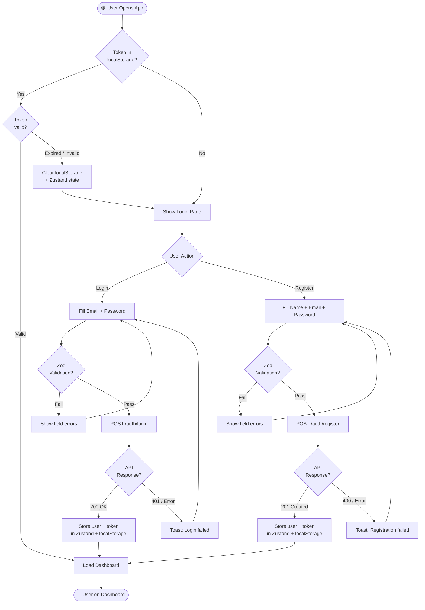
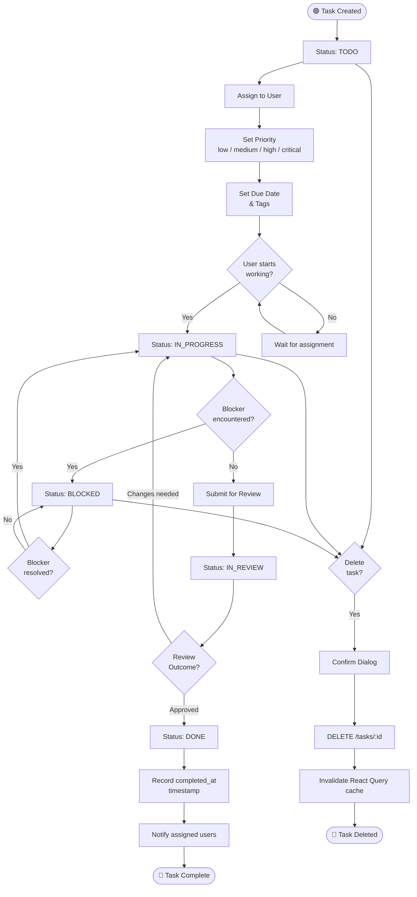
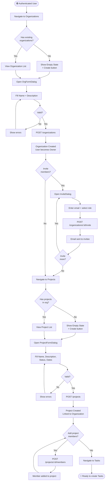
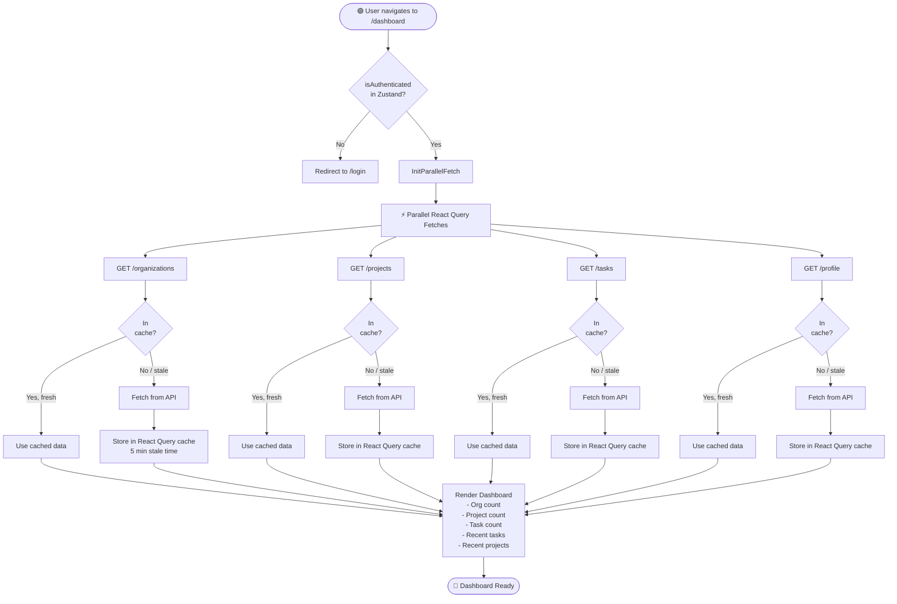

# Activity Diagrams

> Step-by-step process flows showing decision points and parallel activities.

---

## 1. User Authentication Activity

---

## 2. Task Lifecycle Activity

---

## 3. Organization & Project Setup Activity

---

## 4. Dashboard Load Activity

