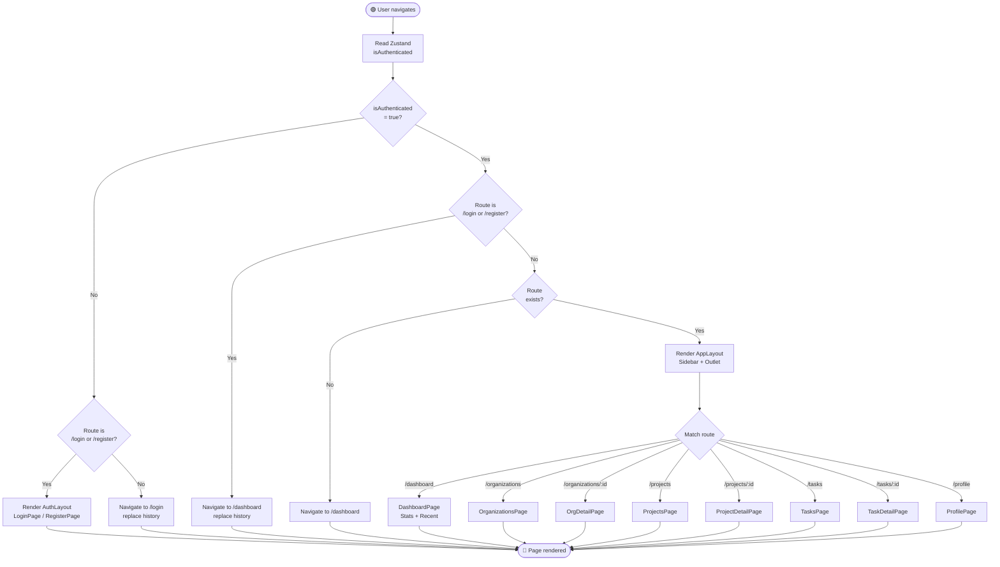
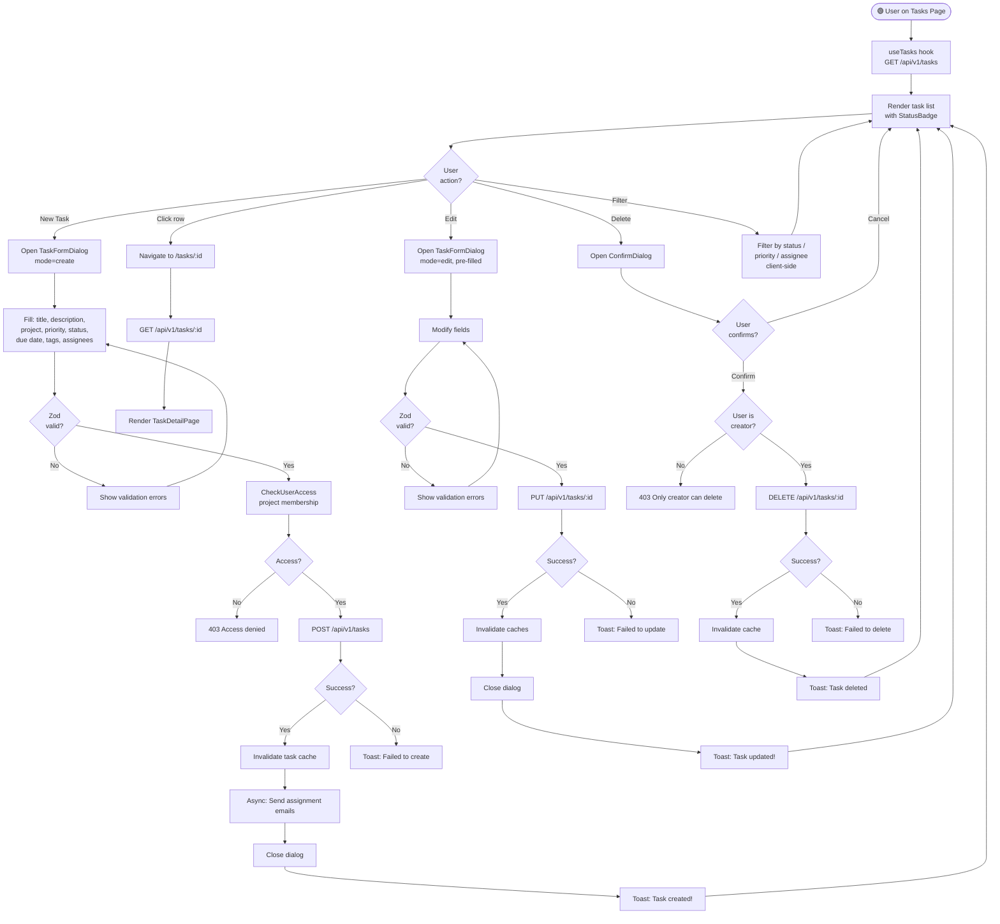
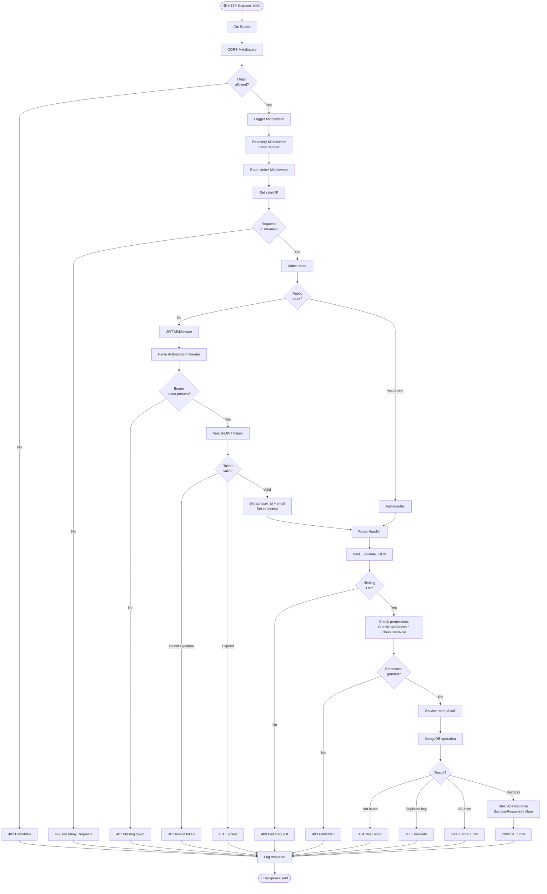

# Flowcharts

> Detailed process flows for key system operations and data paths.

---

## 1. Complete API Request / Response Flowchart

```mermaid
flowchart TD
    Start([🟢 Component action]) --> HookCall[Custom Hook\ne.g. useCreateTask]

    HookCall --> RQMutation[React Query\nuseMutation]
    RQMutation --> AxiosReq[Axios creates request]

    AxiosReq --> ReqInterceptor[Request Interceptor]
    ReqInterceptor --> HasToken{Token in\nlocalStorage?}
    HasToken -->|Yes| AttachJWT[Attach Authorization:\nBearer <token>]
    HasToken -->|No| SendNoAuth[Send without auth]

    AttachJWT --> SendHTTP[HTTP Request to\nGo/Gin :8080]
    SendNoAuth --> SendHTTP

    SendHTTP --> CORSCheck{CORS\nOrigin OK?}
    CORSCheck -->|No| CORS403[403 Forbidden]
    CORSCheck -->|Yes| RateLimitCheck{Rate limit\n< 100/min?}

    RateLimitCheck -->|No| Rate429[429 Too Many Requests]
    RateLimitCheck -->|Yes| RouteType{Route\ntype?}

    RouteType -->|Public /auth/*| PublicHandler[Auth Handler]
    RouteType -->|Protected| JWTCheck{JWT\nvalid?}

    JWTCheck -->|Missing| JWT401A[401 Missing token]
    JWTCheck -->|Invalid| JWT401B[401 Invalid token]
    JWTCheck -->|Expired| JWT401C[401 Token expired]
    JWTCheck -->|Valid| ExtractUser[Extract user_id\ninto context]

    ExtractUser --> RouteHandler[Route Handler]
    PublicHandler --> RouteHandler

    RouteHandler --> ParseBody[Parse + validate\nrequest body]
    ParseBody --> BodyValid{Body\nvalid?}
    BodyValid -->|No| Bad400[400 Bad Request]
    BodyValid -->|Yes| CheckPerm{Permission\ncheck?}

    CheckPerm -->|Denied| Forbidden403[403 Forbidden]
    CheckPerm -->|Granted| ServiceCall[Service Layer call]

    ServiceCall --> DBOp[MongoDB operation]
    DBOp --> DBResult{DB\nresult?}
    DBResult -->|Not found| NotFound404[404 Not Found]
    DBResult -->|DB error| Server500[500 Internal Error]
    DBResult -->|Success| BuildResp[Build ApiResponse\n{ success, data }]

    BuildResp --> Success2xx[200/201 JSON response]

    Success2xx --> RespInterceptor[Response Interceptor]
    CORS403 --> RespInterceptor
    Rate429 --> RespInterceptor
    JWT401A --> RespInterceptor
    JWT401B --> RespInterceptor
    JWT401C --> RespInterceptor
    Bad400 --> RespInterceptor
    Forbidden403 --> RespInterceptor
    NotFound404 --> RespInterceptor
    Server500 --> RespInterceptor

    RespInterceptor --> Is401{Status\n= 401?}
    Is401 -->|Yes| ClearAuth[Clear localStorage\nClear Zustand\nwindow.location = /login]
    Is401 -->|No| RQCallback{Success or\nError?}

    RQCallback -->|onSuccess| InvalidateCache[Invalidate React Query\nrelated caches]
    RQCallback -->|onError| ShowError[Toast error message]

    InvalidateCache --> Refetch[Refetch affected queries]
    Refetch --> UpdateUI[Update UI]
    ShowError --> UpdateUI

    UpdateUI --> ShowToast[Show success toast]
    ShowToast --> End([🔴 Action complete])
    ClearAuth --> End2([🔴 Logged out])
```

---

## 2. Frontend Routing & Auth Guard Flowchart



---

## 3. Task CRUD Flowchart



---

## 4. Backend Request Processing Flowchart



---

## 5. Data Model Relationship Flowchart

```mermaid
flowchart LR
    subgraph UserDoc["👤 User"]
        U_id["_id: ObjectID"]
        U_email["email: string (unique idx)"]
        U_name["name: string"]
        U_password["password: bcrypt hash"]
        U_orgs["organizations: []ObjectID"]
        U_verified["email_verified: bool"]
        U_pic["profile_picture?: string"]
    end

    subgraph OrgDoc["🏢 Organization"]
        O_id["_id: ObjectID"]
        O_name["name: string"]
        O_desc["description: string"]
        O_owner["owner_id: ObjectID → User"]
        O_members["members: []{\nuser_id: ObjectID\nrole: owner|admin|member\njoined_at: time\n} (idx on user_id)"]
    end

    subgraph ProjectDoc["📁 Project"]
        P_id["_id: ObjectID"]
        P_name["name: string"]
        P_desc["description: string"]
        P_org["organization_id: ObjectID → Org (idx)"]
        P_owner["owner_id: ObjectID → User"]
        P_members["members: []ObjectID (idx)"]
        P_status["status: active|completed|archived"]
        P_dates["start_date?, end_date?"]
    end

    subgraph TaskDoc["✅ Task"]
        T_id["_id: ObjectID"]
        T_title["title: string"]
        T_desc["description: string"]
        T_project["project_id: ObjectID → Project (idx)"]
        T_creator["created_by: ObjectID → User"]
        T_assigned["assigned_to: []ObjectID (idx)"]
        T_status["status: todo|in_progress|in_review|done|blocked (idx)"]
        T_priority["priority: low|medium|high|critical"]
        T_tags["tags: []string"]
        T_dates["due_date?, completed_at?"]
    end

    subgraph InvDoc["📨 Invitation"]
        I_id["_id: ObjectID"]
        I_type["type: organization|project"]
        I_email["email: string"]
        I_inviter["invited_by: ObjectID → User"]
        I_resource["resource_id: ObjectID → Org|Project"]
        I_role["role: OrganizationRole"]
        I_status["status: pending|accepted|declined|expired|revoked"]
        I_token["token: 64-char hex (unique)"]
        I_expires["expires_at: time (7 days)"]
    end

    %% Relationships
    UserDoc -->|"owns (1:M)"| OrgDoc
    UserDoc -->|"member of (M:M)"| OrgDoc
    UserDoc -->|"owns (1:M)"| ProjectDoc
    UserDoc -->|"member of (M:M)"| ProjectDoc
    UserDoc -->|"creates (1:M)"| TaskDoc
    UserDoc -->|"assigned to (M:M)"| TaskDoc
    UserDoc -->|"invites (1:M)"| InvDoc

    OrgDoc -->|"contains (1:M)"| ProjectDoc
    OrgDoc -->|"has invitations (1:M)"| InvDoc

    ProjectDoc -->|"contains (1:M)"| TaskDoc
    ProjectDoc -->|"has invitations (1:M)"| InvDoc

    classDef userStyle fill:#1e3a5f,stroke:#4a9eff,color:#fff
    classDef orgStyle fill:#3a2a1a,stroke:#ffaa4a,color:#fff
    classDef projStyle fill:#1a3a3a,stroke:#4affff,color:#fff
    classDef taskStyle fill:#3a1a1a,stroke:#ff6b6b,color:#fff
    classDef invStyle fill:#2a1a3a,stroke:#aa6bff,color:#fff

    class U_id,U_email,U_name,U_password,U_orgs,U_verified,U_pic userStyle
    class O_id,O_name,O_desc,O_owner,O_members orgStyle
    class P_id,P_name,P_desc,P_org,P_owner,P_members,P_status,P_dates projStyle
    class T_id,T_title,T_desc,T_project,T_creator,T_assigned,T_status,T_priority,T_tags,T_dates taskStyle
    class I_id,I_type,I_email,I_inviter,I_resource,I_role,I_status,I_token,I_expires invStyle
```


