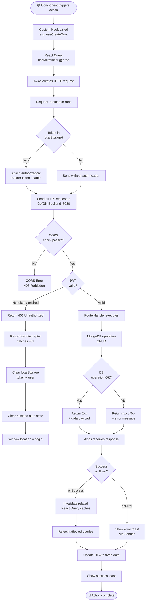
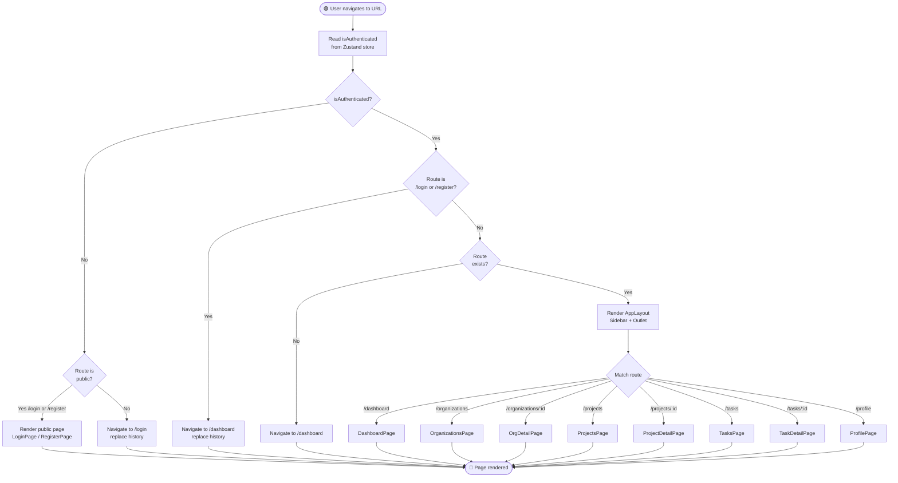
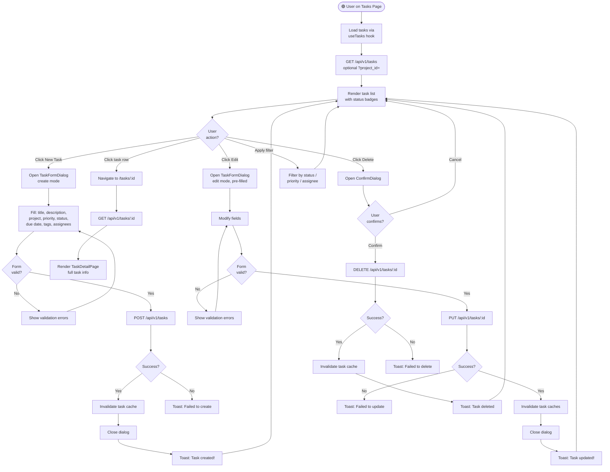

# Flowcharts

> Detailed process flows for key system operations and data paths.

---

## 1. API Request / Response Flowchart



---

## 2. Frontend Routing & Auth Guard Flowchart



---

## 3. Task CRUD Flowchart



---

## 4. Backend Request Processing Flowchart

```mermaid
flowchart TD
    Start([🟢 HTTP Request arrives\nat :8080]) --> CORSMiddleware[CORS Middleware\nCheck Origin header]

    CORSMiddleware --> OriginAllowed{Origin\nallowed?}
    OriginAllowed -->|No| Return403[Return 403 Forbidden]
    OriginAllowed -->|Yes| RouteMatch[Gin Router\nmatches route]

    RouteMatch --> IsPublicRoute{Public\nroute?}
    IsPublicRoute -->|Yes /auth/*| AuthHandler[Auth Handler\nregister / login]
    IsPublicRoute -->|No| JWTMiddleware[JWT Middleware\nextract Bearer token]

    JWTMiddleware --> TokenPresent{Token\npresent?}
    TokenPresent -->|No| Return401A[Return 401\nMissing token]
    TokenPresent -->|Yes| ValidateJWT{JWT\nsignature valid?}

    ValidateJWT -->|No| Return401B[Return 401\nInvalid token]
    ValidateJWT -->|Expired| Return401C[Return 401\nToken expired]
    ValidateJWT -->|Valid| ExtractUserID[Extract user_id\nfrom JWT claims]

    ExtractUserID --> RouteHandler[Route Handler\nexecutes business logic]

    RouteHandler --> ParseBody[Parse + validate\nrequest body]
    ParseBody --> BodyValid{Body\nvalid?}
    BodyValid -->|No| Return400[Return 400\nBad Request + errors]
    BodyValid -->|Yes| CheckPermission{Permission\ncheck?}

    CheckPermission -->|Unauthorized| Return403B[Return 403\nForbidden]
    CheckPermission -->|Authorized| MongoOperation[Execute MongoDB\noperation]

    MongoOperation --> DBResult{DB\nresult?}
    DBResult -->|Not found| Return404[Return 404\nNot Found]
    DBResult -->|DB error| Return500[Return 500\nInternal Server Error]
    DBResult -->|Success| BuildResponse[Build ApiResponse\n{ success, data }]

    BuildResponse --> Return2xx[Return 200/201\nwith JSON payload]

    AuthHandler --> HashOrVerify{Register\nor Login?}
    HashOrVerify -->|Register| HashPassword[Hash password\nbcrypt]
    HashOrVerify -->|Login| VerifyPassword[Verify password\nhash]

    HashPassword --> InsertUser[Insert user\nto MongoDB]
    VerifyPassword --> PasswordMatch{Match?}
    PasswordMatch -->|No| Return401D[Return 401\nInvalid credentials]
    PasswordMatch -->|Yes| GenerateJWT[Generate JWT\nwith user_id claim]

    InsertUser --> GenerateJWT
    GenerateJWT --> ReturnAuthResponse[Return 200/201\n{ user, token }]

    Return403 --> End([🔴 Response sent])
    Return401A --> End
    Return401B --> End
    Return401C --> End
    Return400 --> End
    Return403B --> End
    Return404 --> End
    Return500 --> End
    Return2xx --> End
    Return401D --> End
    ReturnAuthResponse --> End
```

---

## 5. Data Model Relationship Flowchart

```mermaid
flowchart LR
    subgraph UserDoc["👤 User Document"]
        U_id["id: UUID"]
        U_email["email: string (unique)"]
        U_name["name: string"]
        U_orgs["organizations: string[]"]
        U_verified["email_verified: bool"]
    end

    subgraph OrgDoc["🏢 Organization Document"]
        O_id["id: UUID"]
        O_name["name: string"]
        O_owner["owner_id → User.id"]
        O_members["members: [{user_id, role, joined_at}]"]
    end

    subgraph ProjectDoc["📁 Project Document"]
        P_id["id: UUID"]
        P_name["name: string"]
        P_org["organization_id → Org.id"]
        P_owner["owner_id → User.id"]
        P_members["members: [User.id]"]
        P_status["status: active|completed|archived"]
    end

    subgraph TaskDoc["✅ Task Document"]
        T_id["id: UUID"]
        T_title["title: string"]
        T_project["project_id → Project.id"]
        T_creator["created_by → User.id"]
        T_assigned["assigned_to: [User.id]"]
        T_status["status: todo|in_progress|in_review|done|blocked"]
        T_priority["priority: low|medium|high|critical"]
        T_tags["tags: string[]"]
    end

    %% Relationships
    UserDoc -->|"owns (1:M)"| OrgDoc
    UserDoc -->|"member of (M:M)"| OrgDoc
    UserDoc -->|"owns (1:M)"| ProjectDoc
    UserDoc -->|"member of (M:M)"| ProjectDoc
    UserDoc -->|"creates (1:M)"| TaskDoc
    UserDoc -->|"assigned to (M:M)"| TaskDoc

    OrgDoc -->|"contains (1:M)"| ProjectDoc
    ProjectDoc -->|"contains (1:M)"| TaskDoc

    classDef userStyle fill:#1e3a5f,stroke:#4a9eff,color:#fff
    classDef orgStyle fill:#3a2a1a,stroke:#ffaa4a,color:#fff
    classDef projStyle fill:#1a3a3a,stroke:#4affff,color:#fff
    classDef taskStyle fill:#3a1a1a,stroke:#ff6b6b,color:#fff

    class U_id,U_email,U_name,U_orgs,U_verified userStyle
    class O_id,O_name,O_owner,O_members orgStyle
    class P_id,P_name,P_org,P_owner,P_members,P_status projStyle
    class T_id,T_title,T_project,T_creator,T_assigned,T_status,T_priority,T_tags taskStyle
```


